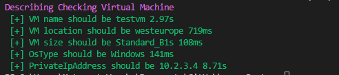

# azurePester

Test your Azure resources with Pester

## Install

```powershell
git clone https://github.com/kongou-ae/azurePester.git
cd azurePester
Import-Module ./azurePester.psm1
```

## Usage

```powershell
$vms = Get-AzureRmVM
$vm = $vms[0]
$vm | Test-AzRmVm -Name testvm `
            -VmSize Standard_B1s `
            -Location westeurope `
            -OsType Windows `
            -PrivateIpAddress 10.2.3.4 `
            -AdminUsername aimless `
            -DataDisks_Count 0

$vnets = Get-AzureRmVirtualNetwork
$vnet = $vnets[0]
$vnet | Test-AzRmVnet -Name azurelabvnet648 `
            -Location westus `
            -AddressPrefixes @("10.2.0.0/24","10.3.0.0/24") `
            -DnsServers @("8.8.8.8","8.8.8.4")

$storages = Get-AzureRmStorageAccount
$storage = $storages[0]
$storage | Test-AzRmStorageAccount `
            -StorageAccountName diintugy6w5poazfunctions `
            -SkuName StandardLRS `
            -Location westus `
            -EnableHttpsTrafficOnly true

```

The result is following.




## Method

azurePester supports three assertion methods of Pester. Default is `Should Be`. Others are `Should BeExactly` and `Should Match`. You can set `-Method` parameter to use other methods.

```powershell
$vnets = Get-AzureRmVirtualNetwork
$vnet = $vnets[0]

# The name of VNet is azurelabvnet648. So this check is OK.
$vnet | Test-AzRmVnet -Method "Should Match" `
            -Name ^azurelab

# This check is NG
$vnet | Test-AzRmVnet -Method "Should Match" `
            -Name ^lab
```


## Supported recources

- Virtual Machine
  - Name
  - VmSize
  - Location
  - OsType
  - PrivateIpAddress
  - AdminUsername
  - DataDisks_Count
- Virtual Network
  - Name
  - Location
  - AddressPrefixes
  - DnsServers
- Storage Account
  - StorageAccountName
  - Location
  - SkuName
  - EnableHttpsTrafficOnly